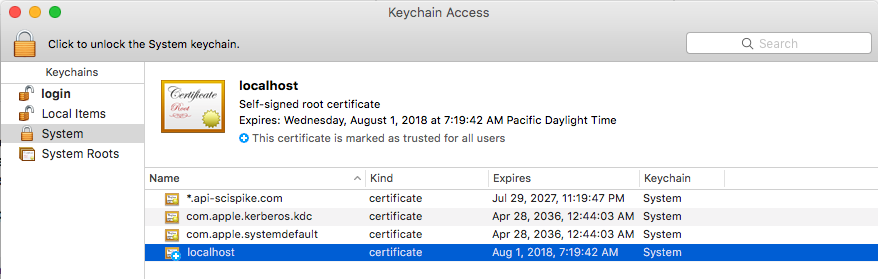
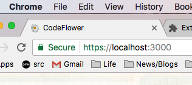

This doc explains how to create a self-signed SSL certificate, using openssl on mac, that Chrome will accept when you serve content over https on localhost. This allows you to develop using https, and avoid issues when you transition to a live server. Most of the following is taken from [this article](https://alexanderzeitler.com/articles/Fixing-Chrome-missing_subjectAltName-selfsigned-cert-openssl/). The trick that makes Chrome accept it is using an external file to populate the subjectAltName field, in Step 3 below. 

### Step 1: Create a Folder and cd Into It 

You'll want a folder to hold the key and cert files. Create the folder in a convenient location with respect to the server(s) you want to use it with. Then cd into it. All the commands below should be run in that folder.

### Step 2: Generate a Certificate Signing Request (CSR)

```
openssl req -new -sha256 -nodes -out \server.csr -newkey rsa:2048 -keyout \server.key -config <(
cat <<-EOF
[req]
default_bits = 2048
prompt = no
default_md = sha256
distinguished_name = dn
 
[ dn ]
C=US
ST=California
L=Los Angeles
O=Codeflower
OU=Jake
emailAddress=jake.mensch@gmail.com
CN = localhost
EOF
)
```

### Step 3: Generate the Certificate Using the CSR 

```
openssl x509 -req -sha256 -days 365 -in server.csr -signkey server.key -out server.crt -extfile <(
cat <<-EOF
authorityKeyIdentifier=keyid,issuer
basicConstraints=CA:FALSE
keyUsage = digitalSignature, nonRepudiation, keyEncipherment, dataEncipherment
subjectAltName = @alt_names

[alt_names]
DNS.1 = localhost
EOF
)
```

### Step 4: Check the Properties of the Cert

```
openssl x509 -text -in server.crt -noout
```

You should see version 3, and localhost in the subjectAltName section.

### Step 5: Add the Cert to the Mac Keychain

When you serve this cert, Chrome will initially give a privacy error. Open the Security tab in devtools and you'll see an error regarding the certificate authority not being valid. Click on View Certificate, and when you see the cert, drag the cert icon to your desktop. Then double-click it to open the Keychain Access window, and you'll see the localhost cert. Click on it to open another window, click on the Trust triangle, and select Always Trust in the top dropdown. The Keychain Access manager should then indicate that the cert is trusted.



Then restart chrome (chrome://restart). Chrome should now accept the certificate, and you'll get the green lock icon in the location bar.



### Step 6 (optional): Use Browsersync to Serve Client Over HTTPS

You can use browsersync to serve the front-end code, like this:

```
browserSync.init({
  port: 3000,
  server: './dist',
  https: {
    key:  '[path to cert dir]/server.key',
    cert: '[path to cert dir]/server.crt'
  }
});
```

